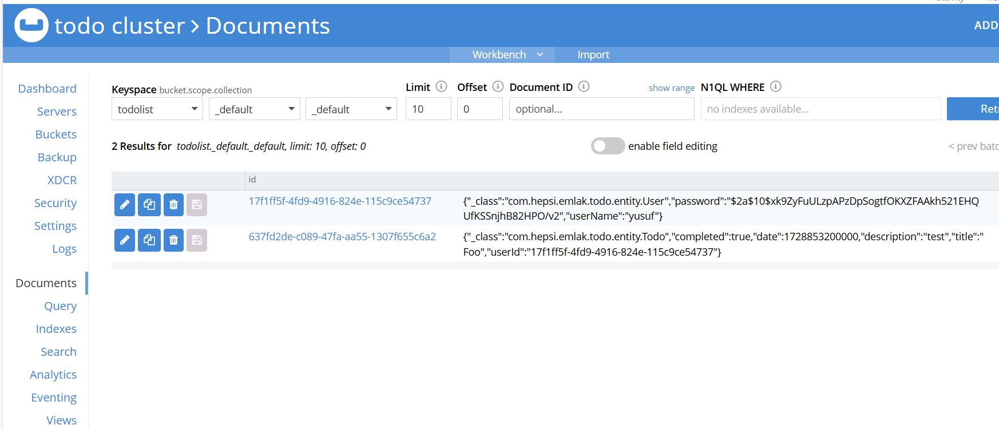
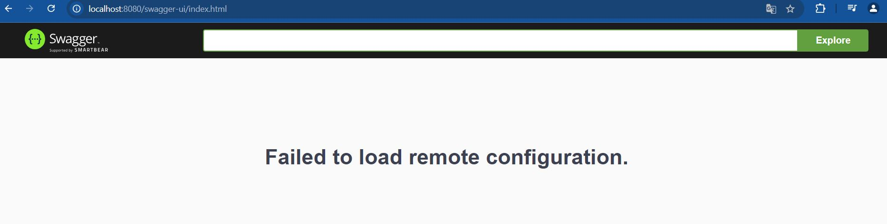
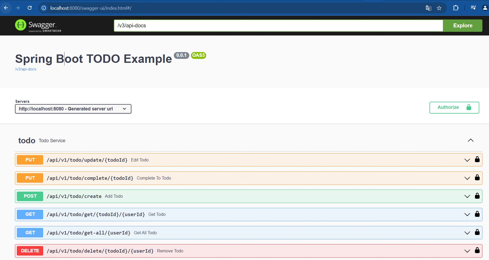

# todo-app

This project is a todo list application. Users can register and, 
after registering, log in to receive a JWT token. 
Without logging in, users cannot perform todo operations or 
any other actions without using a JWT token. After logging 
in and verifying their identity with the JWT token,
users can add, delete, update, and list todos.

**Database**
- Couchbase

**Controllers**
- AuthController
- TodoController

**Auth Controller**
- login
- register

**Todo Controller**
- add Todo
- update Todo
- delete Todo
- get Todo
- get All Todos By UserId
- complete Todo

**DesignPattern**
- I used three design patterns. These are Singleton,Builder and Repository.

**Mapper**
- I used mapstruct mapper

**Java Version**
- Java 17

## Used Dependencies
* Spring Boot Web
* Spring Boot Validation
* Spring Boot Data Couchbase
* Spring Boot Security
* JWT
* Springdoc OpenApi (openapi-ui + security)
* Mapstruct
* Lombok
* Mockito
* JUnit
* Swagger

## Technology Stack
* Spring Boot
* Spring Data Couchbase
* Swagger
* Maven
* Docker
* JUnit and Mockito

# Installation
Prerequisites:
*  Docker
*  Docker Compose

```
docker-compose up -d
```

### Couchbase UI
> **Access : http://localhost:8091/**
- Couchbase bucket name: The name of the cocuhbase bucket should be todolist. Because I gave the bucket name todolist in the docker-compose.yml and application.yaml files.

 


### Swagger
> **Access : http://localhost:8080/swagger-ui/index.html**

- In step 1, you will see the warning in the image below.

 

- In step 2, if you type /v3/api-docs in the text box next to explore and click Explore, it will bring up the swagger APIs.

 

# Deployment Docker Hub
- I deployed the project to docker hub.You can reach us from the link below.
- https://hub.docker.com/r/yusufkusar34/todo

# Application Summary

- You register to the application with username and password via the register endpoint. After registering to the application, you try to log in to the application via the login 
endpoint with username and password. If you successfully log in to the application, the response returns token and userId. You are authorized with this token. 
After you become an author, you perform the todo operations.


